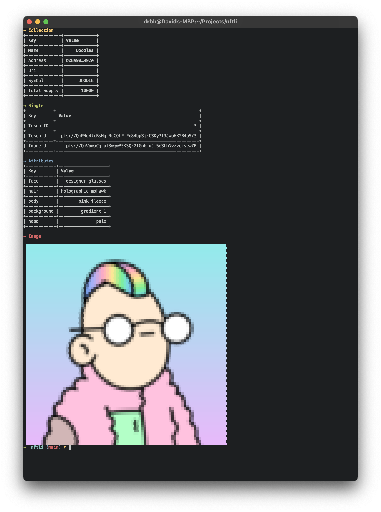

# NFTLI

NFT's in your terminal.

**Features**  
- [X] Get NFT's from source (ETH, IPFS...)
- [X] Show collection information in console
- [X] Show token information in console



### View

only show collection
```bash
nftli view --address 0x8a90cab2b38dba80c64b7734e58ee1db38b8992e 
```

show collection and specific token
```bash
nftli view --address 0x8a90cab2b38dba80c64b7734e58ee1db38b8992e --token-id 0 
```

show collection and specific token and view
```bash
nftli view --address 0x8a90cab2b38dba80c64b7734e58ee1db38b8992e --token-id 0 --show
```

### Download


download whole collection
```bash
nftli download --address 0x8a90cab2b38dba80c64b7734e58ee1db38b8992e 
```

download specific token
```bash
nftli download --address 0x8a90cab2b38dba80c64b7734e58ee1db38b8992e --token-id 0 
```